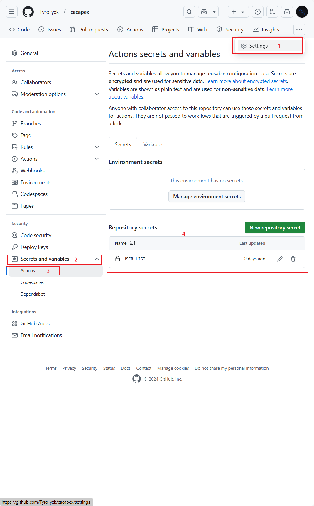

# cacapex

利用[github action](actions)自动获取cacapex免费订阅
创建环境变量<font color='red'>***USER_LIST***</font>，格式如下：
```text
    userName1,password2;username2,password2;email3,password3
```
内容为登录的账号（邮箱），密码；账号与密码之间用英文都好(,)隔开，账号与账号之间用英文分号(;)隔开


环境变量创建教程
